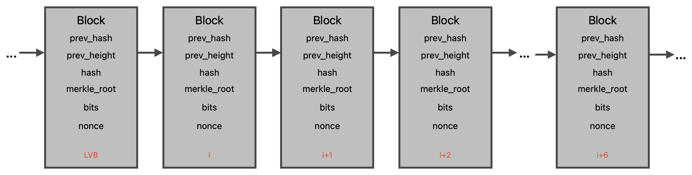

## Trustless Bitcoin blocks verification for asset exchanges between Bitcoin and EVM/Solana.
The idea is to create an escrow order in a target chain and prove Bitcoin transaction to target address via zk light client.

#### The BTC block proof scheme consists of the following steps:
1. Create two smart contracts:
    - Smart contract for exchange (SCE);
    - Smart contract for storing data about the Bitcoin valid chain (SCS).
2. Make a zk-proof of the block data.

**SCE** implements the exchange logic and sends requests to the SCS. The SCS must be constantly running to maintain the network and correct block data from the valid chain. A single block in Bitcoin becomes final approximately after six blocks have been built on top of it (~10 min for one block, i.e. 1 hour for 6 blocks). Accordingly, we propose to update one block every hour to keep the “local chain” (in SCS) up-to-date. The scheme checks the prev_hash, prev_height and PoW of the block. 

**SCS** contains the hash, height and PoW of the block (or chain). We check the chain PoW to make sure that the valid chain contains the requested block. When smb makes a swap request, SCE makes a request to SCS to check if the “local chain” contains the required block (the latest valid block in the chain), which can be used as a trusted point to confirm the requested block.
   
**Zk-proof of the block data.** The scheme uses seven blocks from RPC (including the requested one) to prove the block and the data of the last valid block stored in SCS. 
The following data needs to be proven:
1. Check hash of the block: `sha256(sha256(proposed_block_header)) = block.hash`;
2. Check prev_hash in all eight blocks: `block.prev_block_hash = prev_block.hash`;
3. Check prev_height in all eight blocks: `block.height = prev_block.height + 1`;
4. Check PoW in all eight blocks. This check confirms that the current block is valid: `sha256(sha256(proposed_block_header)) <= target_block_difficulty`;
5. Check PoW of the chain, i.e. the heaviest chain, and PoW of the requested block. It confirms that the requested block is included in the valid chain.

